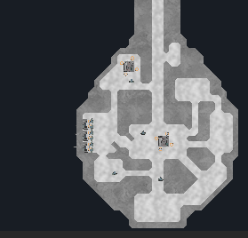

# Spaceships
 An experiment where I mess around with Marching Squares, A*, and Mesh Building.

## Controls

 W,A,S,D - To move the ship

 Space - Launch High Speed Projectiles at Center of Screen (One Off)

 C - toggle Spaceship Draw Mode (Make sure to turn off before entering other modes!)

    Left Mouse - Build Wall
    Right Mouse - Build Floor
    Middle Mouse - Destroy Tile

 X - toggle Crew Interaction Mode (Make sure to turn off before entering other modes!)

    Left Mouse - Place Crewman (Click on a floor tile)
    Right Mouse - Order All to Move (Click on a floor tile))

 Z - toggle Module Interaction Mode (Make sure to turn off before entering other modes!)

    Left Mouse - Build Module
    Right Mouse - Delete Module
    Middle Mouse - Destroy Module
    R - Rotate Module Template
    1 - Select Generator Module
    2 - Select Machine Gun Module

## Interesting Things

### Loading Spaceships

This project is set up to load a prebuilt spaceship from a png file. Cause I got tired of making a new ship everytime I wanted to conduct a test.

Above is what an input png looks like, walls and floors are based on pixel colors.

### Marching Squares

The spaceship is made on a grid system but is made to look smooth by taking the 4 points that surround any given square and depending how they are arranged (on or off) creating a mesh to represent the interaction between those 4 points. For example, if the bottom two points are active, then it will display an upward facing wall or if the left-bottom is the only active point it will make a wall corner surrounding that point. I think it looks much more dynamic and prettier than any square based system. I suggest you look up Marching Squares if you're more interested.

### Marching Squares Collision Box

The spaceship also needed to have a correct hit box for it's shape, so I created a way to find all the exterior walls of the Marching Squares algorithm and I added a line collider at all of them. Now the spaceship is tangible!

### Destruction and Highspeed Collision

Of course a dynamic spaceship system is kinda useless if you can't blow it up and see what happens. So I made a couple of projectiles that would tear away at the walls of the spaceship depending on their velocity. However, this is space. It is vast and the speeds the projectiles need to travel would be immense. Unity's physics system breaks down at such speeds because it only check for collisions every frame, so projectiles could simply pass over the ship in one frame. So I added an intermediate system that simulates the projectiles inbetween frames. This did the trick and the results look awesome.

### Crew Members and A*

The ship still felt pretty empty, so I added a system to add crew members who can walk around the floors of the ship. To let them walk around I gave them an A* path finding system. That was pretty interesting to implement because the spaceship is constantly changing, meaning paths are constantly opened and closed as the crew members walk around.

### Modules and Work Orders

Now the Crew needed something to do. No freeloaders here. So I added a module system, where you can install different systems onto the spaceship. This amounts to two systems right now, a generator and a machine gun. (They don't do anything, they just give our little crewman a meaningless purpose)

Here's an example of how to place them. The guns have to be placed within walls, 2x1.

With these modules I gave basic tasks for crewmen to complete. The first being manning the guns which they dutifully attend to with their A* path finding. The user can also damage modules and the crewmen will run over to fix them. Each work order, which right now consists of manning guns and repair, has a priority value and Crewmen will give up what they are doing to attend to something more important before moving on to less important orders.

## Final Notes

That about sums up the code in this project. This was less about accomplishing anything and more seeing what interesting systems I could code. Maybe I'll return one day to turn this into a fully fledged video game, with multiple spaceships and awesome space battles. The base is there.

